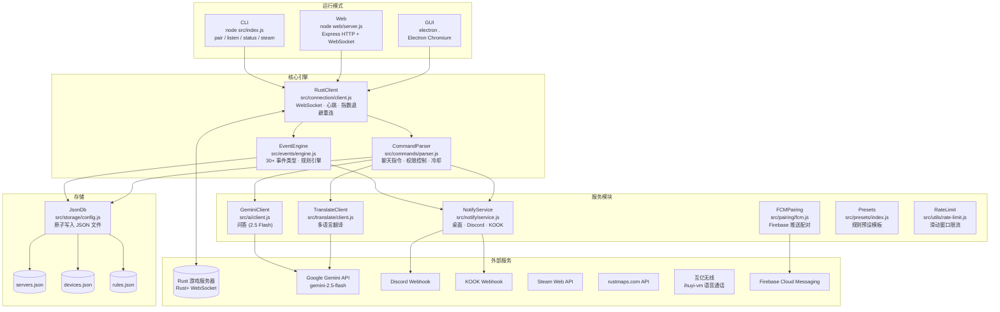
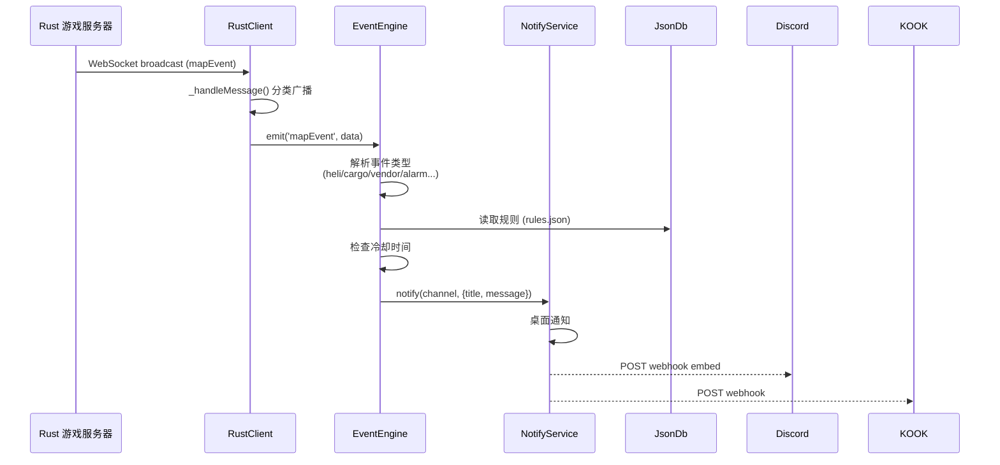
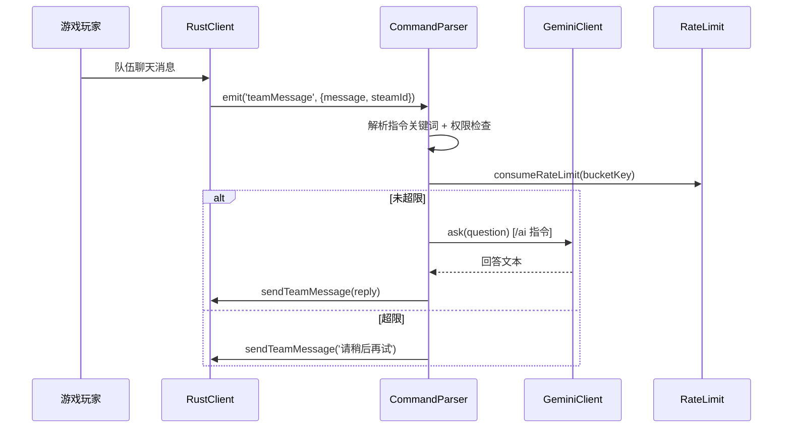

# Rust 工具箱 — 系统架构文档

> 版本：v1.0.0 | 更新：2026-03-15

---

## 一、项目定位

**Rust 工具箱**是一个基于 Rust+（游戏官方伴侣协议）的智能设备管理平台，支持三种运行模式：CLI、Web 服务、Electron GUI。

核心能力：
- 通过 WebSocket 与 Rust 游戏服务器实时通信
- 监听地图事件（直升机、货船、商人等）并触发自动化规则
- 解析队伍聊天指令执行游戏操作
- 多渠道通知（桌面、Discord、KOOK、短信）

---

## 二、系统拓扑



---

## 三、目录结构

```
rust-plus/
├── src/                    # 核心业务逻辑
│   ├── index.js            # CLI 入口（pair / listen / status / steam）
│   ├── ai/client.js        # Gemini AI 问答客户端
│   ├── call/
│   │   ├── groups.js       # 呼叫组管理（语音/Discord/KOOK）
│   │   └── ihuyi-vm.js     # 互亿无线语音通话
│   ├── commands/parser.js  # 聊天指令解析引擎
│   ├── connection/client.js# WebSocket 连接管理器
│   ├── events/engine.js    # 事件逻辑引擎
│   ├── map/                # 地图数据处理
│   ├── notify/service.js   # 多渠道通知服务
│   ├── pairing/fcm.js      # FCM 推送配对
│   ├── presets/index.js    # 规则预设模板
│   ├── steam/profile.js    # Steam 资料查询
│   ├── storage/config.js   # JSON 文件数据库
│   ├── translate/client.js # 翻译服务
│   └── utils/              # 工具集
│       ├── cctv-codes.js   # CCTV 摄像头代码库
│       ├── deep-sea.js     # 深海活动计算
│       ├── item-catalog.js # 物品目录与模糊匹配
│       ├── logger.js       # Winston 日志
│       ├── map-grid.js     # 地图网格坐标转换
│       ├── rate-limit.js   # 滑动窗口限流
│       ├── runtime-paths.js# 运行时路径解析
│       ├── rustmaps.js     # rustmaps.com 集成
│       ├── security.js     # URL 安全验证 + 敏感信息脱敏
│       ├── server-info.js  # 服务器信息快照
│       ├── server-map-payload.js # 地图数据规范化
│       ├── steam-id.js     # Steam ID 规范化
│       └── web-config-rules.js  # Web 规则输入校验
├── web/                    # Web 模式（Express + WebSocket）
│   ├── server.js           # HTTP/WS 服务器、API 路由
│   ├── event-actions.js    # 事件规则动作绑定
│   ├── ipc-invoke.js       # IPC 调用分发
│   ├── runtime-sync.js     # 运行时规则同步
│   └── public/index.html   # Web UI 单页面
├── electron/               # GUI 模式（Electron）
│   ├── main.js             # Electron 主进程
│   └── renderer/index.html # 渲染进程 UI
├── config/                 # 持久化配置（gitignored 的敏感文件）
│   ├── servers.json        # 服务器配对数据（gitignored）
│   ├── devices.json        # 绑定设备列表（gitignored）
│   ├── rules.json          # 事件/指令/呼叫组规则
│   ├── item-catalog.json   # 游戏物品目录
│   └── cctv-codes.json     # CCTV 代码数据库
├── assets/                 # 图标与地图资源
├── test/                   # 单元测试（Node.js 内置 test runner）
└── docs/                   # 文档
```

---

## 四、核心数据流

### 事件监听流程



### 指令处理流程



---

## 五、聊天指令系统

| 指令 | 类型 | 权限 | 功能 |
|------|------|------|------|
| `/ai <问题>` | `ai` | 全员 | Gemini AI 游戏问答 |
| `/shj <物品>` | `query_vendor` | 全员 | 售货机物品查询（价格+坐标+网格） |
| `/fwq` | `server_info` | 全员 | 服务器信息（在线人数/地图尺寸/时间） |
| `/sh` | `deep_sea_status` | 全员 | 深海活动状态与倒计时 |
| `/fy <文本>` | `translate` | 全员 | 多语言翻译（Gemini） |
| `/dz <steamId>` | `change_leader` | Leader | 转移队长 |
| `/fk` | `switch` | 可配置 | 智能开关控制（防空/通用） |
| `/hc` | `query_cargo` | 全员 | 货船位置与状态查询 |
| `/wz` | `query_heli` | 全员 | 武装直升机位置查询 |
| `/jk <地标>` | `cctv` | 全员 | CCTV 摄像头代码查询 |
| `/help` | 内置 | 全员 | 显示可用指令列表 |

---

## 六、事件类型

| 类别 | 事件 ID | 说明 |
|------|---------|------|
| 警报 | `alarm_on` / `alarm_off` | 智能警报器通电/断电 |
| 队友 | `player_status` | 上线/下线/死亡/重生/挂机 整合事件 |
| 直升机 | `patrol_heli_enter/leave/explode/active/status` | 武装直升机全生命周期 |
| 军运机 | `ch47_enter/leave/active/status` | Chinook 运输直升机 |
| 货船 | `cargo_ship_enter/leave/active/at_port/status` | 货船全生命周期 |
| 石油 | `oil_rig_*` / `oil_rig_status` | 大小石油重装科学家与解锁 |
| 商人 | `vendor_appear/move/stopped/leave/status` | 流浪商人位置追踪 |
| 深海 | `deep_sea_open/close/status` | 深海活动开启关闭 |
| 时间 | `hourly_tick` | 游戏整点触发 |
| 天相 | `day_phase_notice` | 天黑/天亮 5分钟/1分钟预警 |

---

## 七、存储结构

### servers.json
```json
{
  "servers": [{
    "id": "server_1710000000000",
    "name": "My Server",
    "ip": "1.2.3.4",
    "port": 28082,
    "playerId": "76561198xxxxxxxxx",
    "playerToken": 123456789,
    "addedAt": "2026-01-01T00:00:00.000Z"
  }]
}
```

### rules.json（简化）
```json
{
  "eventRules": [{ "id": "...", "event": "alarm_on", "enabled": true, ... }],
  "commandRules": [{ "id": "ai", "keyword": "ai", "type": "ai", "enabled": true }],
  "callGroups": [{ "id": "...", "name": "...", "members": [...] }],
  "appState": { "lastServerId": "...", "deepSea": {...} }
}
```

---

## 八、环境变量配置

| 变量 | 必须 | 说明 |
|------|------|------|
| `GEMINI_API_KEY` | 是（如用AI/翻译） | Google Gemini API 密钥 |
| `DISCORD_WEBHOOK_URL` | 否 | Discord 通知 Webhook |
| `WEB_API_TOKEN` | 是（非 loopback） | Web API 认证 Token |
| `WEB_PORT` | 否（默认3080） | Web 服务端口 |
| `RUST_TEAM_MESSAGE_MAX_CHARS` | 否（默认128） | 团队消息最大字符数 |
| `MAX_RECONNECT` | 否（默认20） | 最大重连次数 |
| `HEARTBEAT_INTERVAL` | 否（默认60s） | 心跳间隔（秒） |
| `LOG_LEVEL` | 否（默认info） | 日志级别 |
| `FY_TRANSLATE_RPM` | 否（默认15） | AI/翻译每分钟请求限制 |

---

## 九、已知问题（预存 Bug）

以下 5 个测试用例在优化前即失败，属于预存 bug，未被本次优化影响：

| 测试 | 问题描述 |
|------|---------|
| `command-shj-grid-offset` | SHJ 指令 X/Y 偏移量环境变量边界测试不通过 |
| `command-wz-hc-grid` (×2) | WZ/HC 指令网格偏移量计算偏差（B2 vs B1） |
| `map-grid` (×2) | `markerToGrid9` 边缘坐标归属计算错误（R2/V18 附近） |

*这些 bug 涉及地图坐标边界逻辑，建议后续单独修复。*
